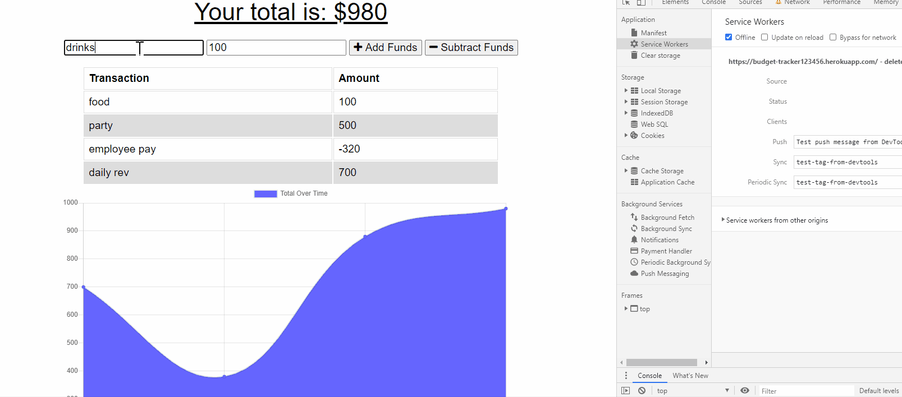

# HW18.budgetTracker

For this homework assignment our goal was to add functionality to the existing Budget Tracker application to allow for offline access and functionality.  The user will be able to add expenses and deposits to their budget with or without a connection. When entering transactions offline, they should populate the total when brought back online.

# Contents
1. [Deployed](#deployed)
2. [User Story](#user-story)
3. [Required criteria](#required-criteria)
4. [Criteria met](#criteria-met)
5. [Example](#example)

## Deployed
https://budget-tracker123456.herokuapp.com/

## User Story
AS AN avid traveller
I WANT to be able to track my withdrawals and deposits with or without a data/internet connection
SO THAT my account balance is accurate when I am traveling.

Giving users a fast and easy way to track their money is important, but allowing them to access that information anytime is even more important. Having offline functionality is paramount to our applications success.

## Required criteria

```
Offline Functionality:


Enter deposits offline


Enter expenses offline


When brought back online:

Offline entries should be added to tracker.
```

## Criteria met

```
Given a user is on Budget App without an internet connect the user can withdrawal or deposit anytime and it will be shown on the page and added to their transaction history when their connection is back online.

```

## Example
Main
